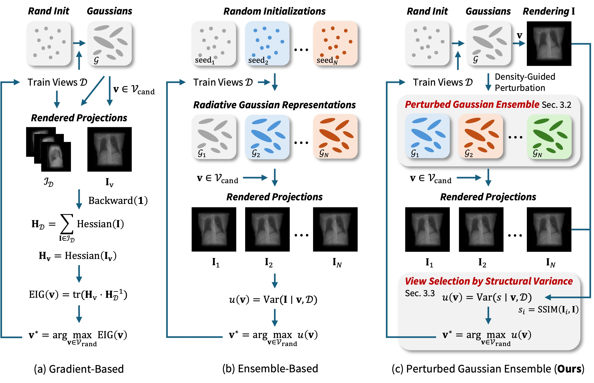

<h2 align="center">
  Active View Selection with Perturbed Gaussian Ensemble for Tomographic Reconstruction
</h2>

  

## Overview

We present *Perturbed Gaussian Ensemble*, a novel active view
selection framework for progressive reconstruction tailored specifically to X-ray
Gaussian Splatting. By applying stochastic density perturbations to
low-density primitives that are highly susceptible to geometric degradation
and measuring the structural disagreement in projection space, our method
accurately localizes epistemic uncertainty and predicts the next best view.
